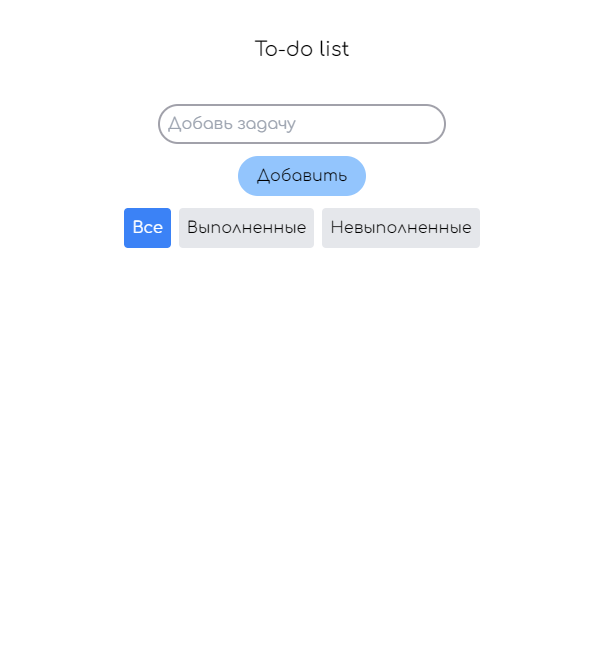
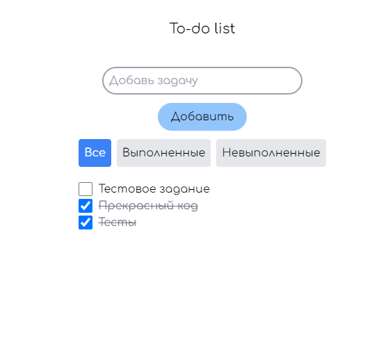
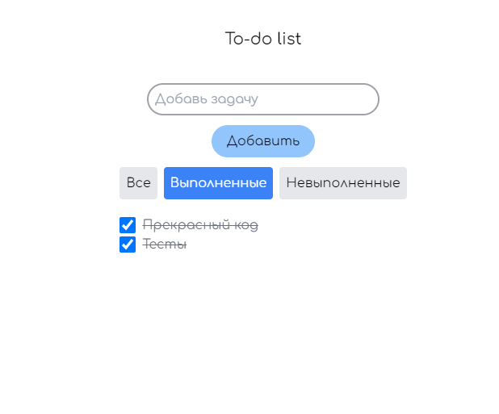

# ToDo-приложение

Это проект, реализующий ToDo-приложение в рамках тестового задания на позицию Junior Frontend Developer в Mindbox. Приложение позволяет управлять списком задач, предоставляя возможность добавления, просмотра и фильтрации задач по статусу (все, выполненные, невыполненные).

## Функциональность

1. **Добавление новой задачи**: Пользователь может ввести задачу в специальное поле и добавить её в общий список задач.
2. **Просмотр задач**:
   - Список всех задач.
   - Отдельные списки для выполненных и невыполненных задач.
3. **Управление задачами**: Возможность отметить задачу как выполненную или невыполненную.

## Технологии

- **React** с использованием **TypeScript**.
- Управление состоянием и логикой приложения реализовано с использованием **React Hooks**.
- Приложение стилизовано с использованием **Tailwind CSS**.
  
## Тестирование

Добавление задачи, отметка о выполнении и отображение в соответсвующих списках покрыто тестами.

## Установка и запуск проекта

Для запуска приложения выполните следующие шаги:

```bash
npm i && npm run start
```

## Деплой

Приложение доступно на Vercel: [To-do app](https://to-do-list-beige-chi.vercel.app)

## Демо






